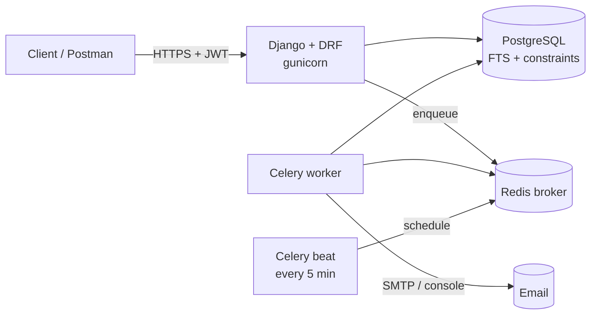
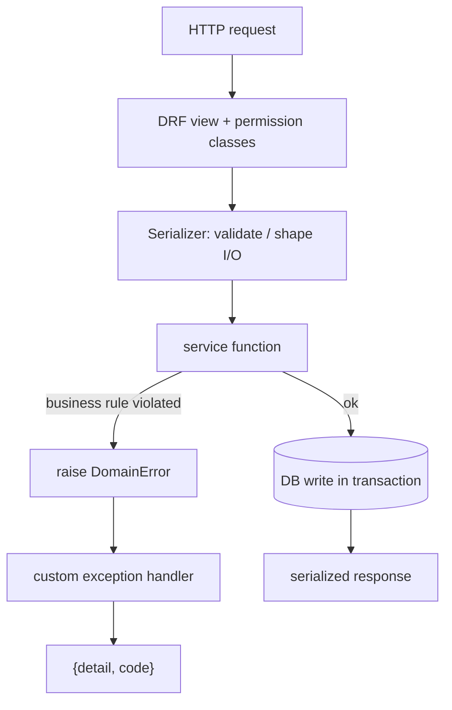
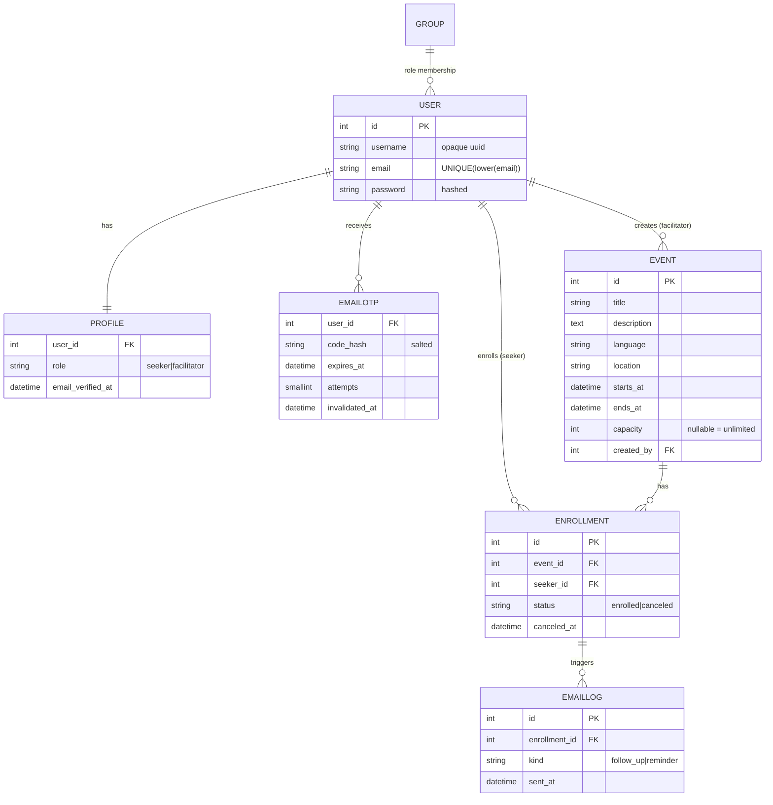

# Architecture

## System components



The web process serves the API and enqueues tasks (OTP emails) on Redis. A Celery
worker consumes them; Celery beat periodically enqueues the two scheduled-mail
jobs. Postgres holds all state and enforces the hard invariants (capacity,
single active enrollment, unique email, single email-per-kind).

## Request lifecycle (thin view → service)



## Data model



### Key constraints & indexes

| Table | Constraint / index | Why |
|-------|-------------------|-----|
| `auth_user` | `UNIQUE (LOWER(email))` partial index | email-login uniqueness the default User lacks |
| `events_event` | `CHECK (ends_at > starts_at)`, `CHECK (capacity >= 1 OR NULL)` | reject invalid events at the DB |
| `events_event` | GIN index on `to_tsvector(title, description)` | fast full-text `q` search |
| `events_event` | btree on `starts_at`, `language`, `location`, `(location, starts_at)` | filter/order without scans |
| `enrollments_enrollment` | `UNIQUE (event, seeker) WHERE status='enrolled'` | at most one *active* enrollment; re-enroll after cancel allowed |
| `notifications_emaillog` | `UNIQUE (enrollment, kind)` | idempotent scheduled mail |

## The enroll race, sequenced

```mermaid
sequenceDiagram
    participant A as Request A
    participant B as Request B
    participant DB as Postgres (event row)
    A->>DB: BEGIN; SELECT ... FOR UPDATE (event)
    B->>DB: BEGIN; SELECT ... FOR UPDATE (event)
    Note over B,DB: B blocks on A's row lock
    A->>DB: count active vs capacity → seat free → INSERT enrollment
    A->>DB: COMMIT (lock released)
    DB-->>B: lock acquired
    B->>DB: count active vs capacity → full → no insert
    B-->>B: raise EventFull (409)
```

Without the row lock both requests would read the pre-insert count and both
insert. The partial unique constraint would still stop a *duplicate* enrollment,
but not overselling distinct seekers — which is exactly why the lock, not just the
constraint, is required.
